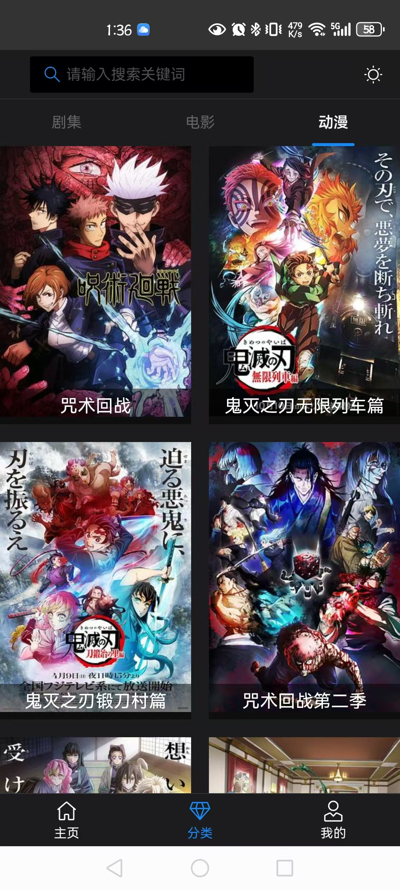

<h1 align="center">SkyTv</h1>

**🌱 基于 Vue3 全家桶、JavaScript、Vite 构建工具、Flask、sqlite3、scrapy，开箱即用的移动端影视项目**

- [x] ⚡ Vue3 + Vite5
- [x] ✨ Vant4 组件库
- [x] 🌀 Tailwindcss 原子类框架
- [x] 🍍 Pinia 状态管理
- [x] 🌓 支持深色模式
- [x] Vue-router 4
- [x] 支持 SVG 图标自动注册组件
- [x] vmin 视口适配
- [x] Axios 封装
- [x] 打包资源 gzip 压缩
- [x] 开发环境支持 Mock 数据
- [x] ESLint
- [x] 首屏加载动画
- [x] 开发环境调试面板
- [x] 生产环境 CDN 依赖
- [x] 影视爬虫


## 截图





## 运行项目

*项目存在2个分支，一个，main分支，一个jellyfin分支，jellyfin分支数据源从通过jellfin api进行获取，main分支则通过爬虫爬取第三方数据存储*

### jellyfin分支技术架构

生产者 ：AutoBangumi(采集) + qBittorrent(下载) + jellyfin(存储)
消费者：jellyfin api + vue3 + van ui


### 前端

注意：本项目为 JS 分支版本，要求 Node 版本 18+，可使用 [nvm](https://github.com/nvm-sh/nvm#installing-and-updating) 进行本地 Node 版本管理，同时建议使用 [pnpm](https://pnpm.io/zh/installation) 包管理器。


```shell
# 克隆项目
git clone https://github.com/sky984-11/SkyTv.git
# 进入项目目录
cd SkyTv
# 安装依赖
pnpm install
# 启动服务
pnpm dev
```


### 后端

```sh
cd app
pip3 install -r requirements.txt
nohup gunicorn -c gunicorn.py run:app &
```


## 影视爬取

```sh
cd parser/scrapy_tv
scrapy crawl keke
```

